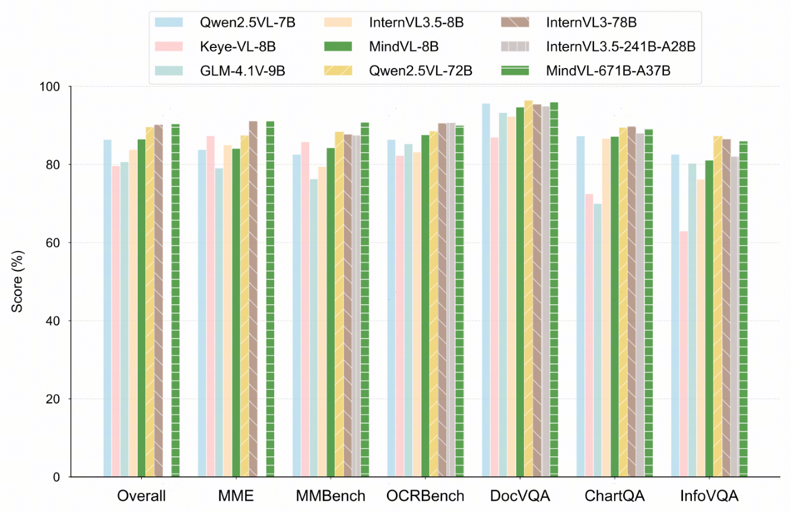

# MindVL
MindVL: Towards Efficient and Effective Training of Multimodal Large Language Models on Ascend NPUs

## Abstract
We propose MindVL, a multimodal large langauge model trained on Ascend NPUs. Similar to Qwen2.5-VL, MindVL adopts native-resolution Vision Transformers, which enables it to process images at their original variable resolutions. This design avoids the degradation caused by fixed-resolution tiling while preserving fine-grained details and global layouts, which is crucial for visually dense content such as complex charts and diagrams.
To ensure the smooth training of MindVL on Ascend NPUs, we develop Mindspeed-MLLM, a distributed multimodal training framework tailored for Ascend NPUs. To maintain training accuracy, we implement equivalent replacements for certain operators.
MindVL undergoes a three-phase training process, namely the warm-up phase, multitask training phase, and supervised instruction tuning phase, to gradually enhance its capabilities. This process starts with basic visual and multimodal pre-training, followed by large-scale multiask trainging and instruction tuning. We also adopt multimodal data packaging and hybrid parallelism techniques, which significantly improve end-to-end training speed. To further boost model performance, we specifically introduce test-time resolution search and model weight averaging.
Notably, despite using about 1/10 of the training data required by Qwen2.5-VL, MindVL achieves performance on par with Qwen2.5-VL in evaluations of general multimodal understanding and document/table comprehension. Beyond overall scores, MindVL also delivers leading performance in OCR assessments.

<p align="center">
     <br>
    Benchmark performance of MindVL and its counterparts.
</p>

## Overview of MindSpeed-MLLM

<p align="center">
     <br>
    The Overall Architecture of MindSpeed-MLLM and Its Relationship with Other MindSpeed Frameworks.
</p>


If you find MindVL useful for your your research and applications, please cite using this BibTeX:
```
@article{chen2025mindvl,
  title={MindVL: Towards Efficient and Effective Training of Multimodal Large Language Models on Ascend NPUs },
  author={Chen, Feilong and Liu, Yijiang and Huang, Yi and Wang, Hao and Tian, Miren and Yu, Ya-Qi and Liao, Minghui and Wu, Jihao},
  journal={arXiv preprint arXiv:2509.11662},
  year={2025}
}
```
